# Online learning app - Final EPAM task

Description
---
-------

Существует перечень Курсов, за каждым из которых
закреплен Преподаватель. Студент записывается на один или
несколько Курсов, выполняет задания. Преподаватель выставляет
ценки за задания Студенту и добавляет отзыв. Администратор
управляет Курсами и Преподавателями.

Database schema
---
-------

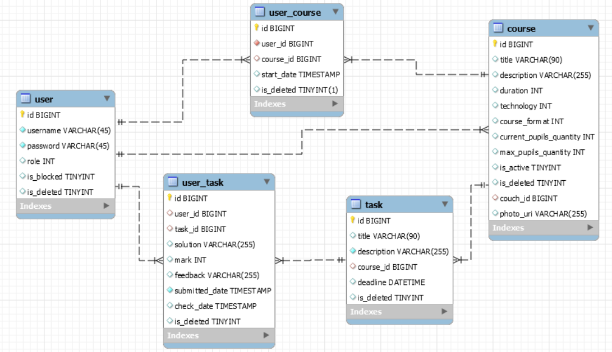

Use-cases(Commands)
---
-------
1. General
    * Login
    * Registration
    * Course list view
    * i18n (EN | RU | BE)
    * Logout
2. User
    * Course page view
    * Subscribe/Unsubscribe
    * View personal courses
    * View course tasks
    * Do tasks
3. Couch
    * Activate course
    * Create course, tasks
    * Edit course
    * Check submitted tasks
4. Admin
    * Block/Unblock users
    * Enable/disable courses
    * Delete courses, users
    * Recover courses
    * Edit user roles

Screenshots
---
------------

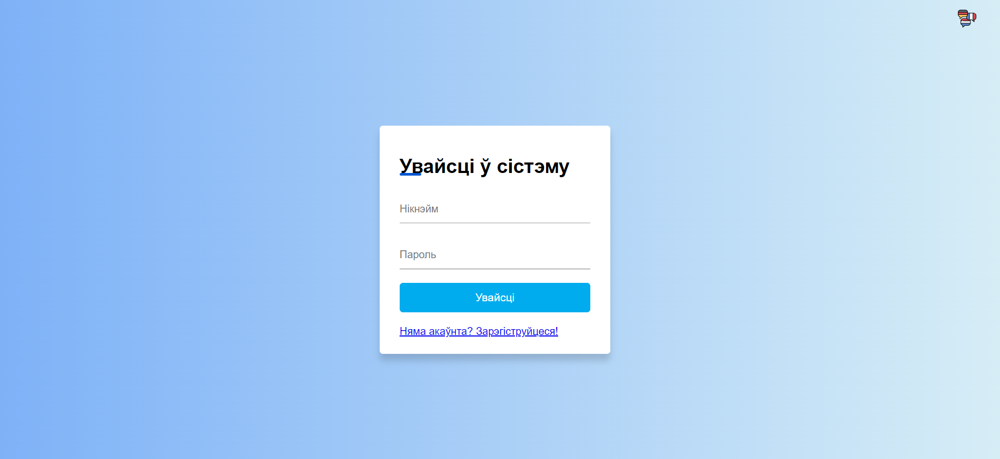
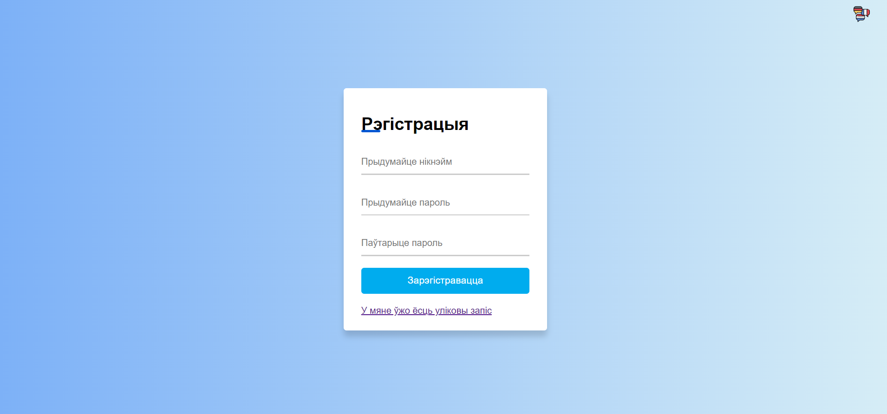
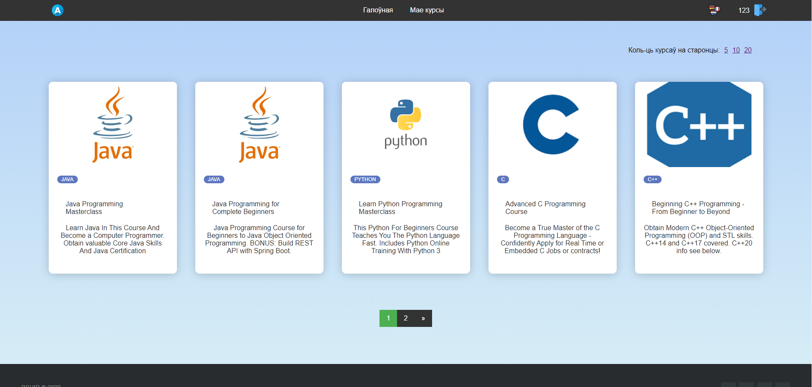
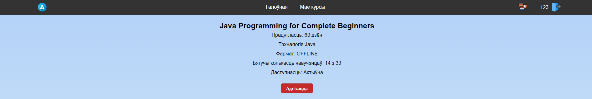
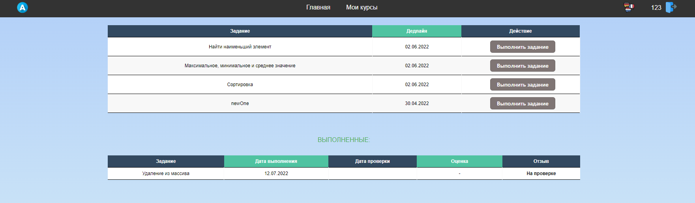
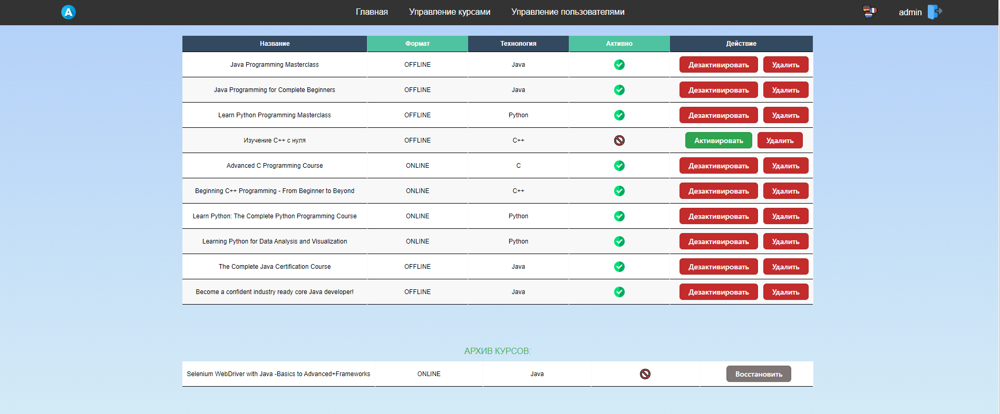
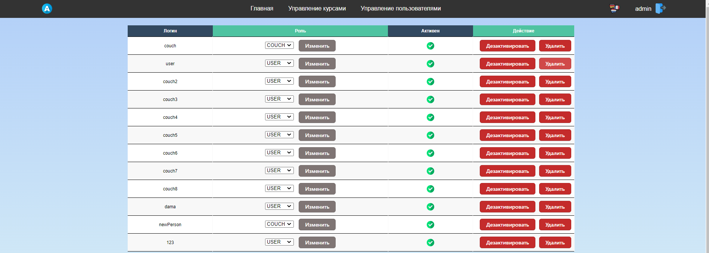
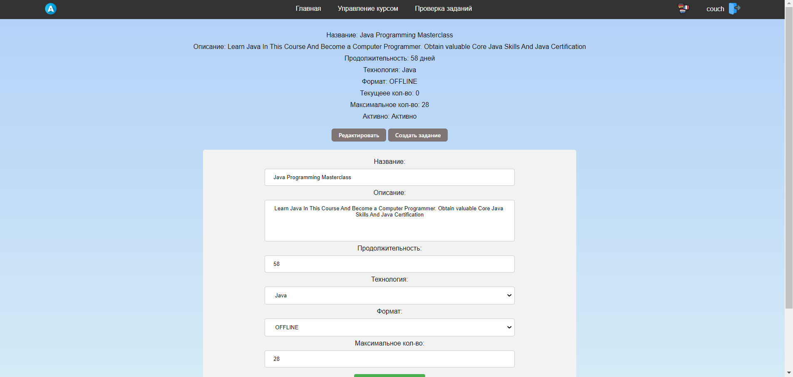

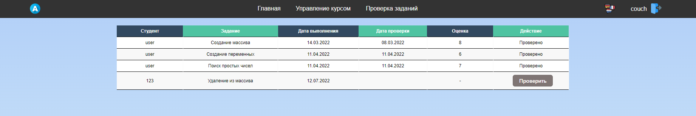
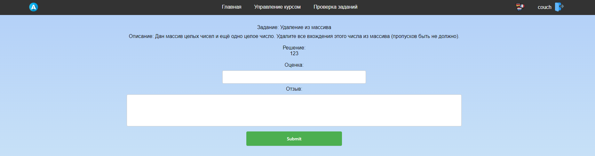
